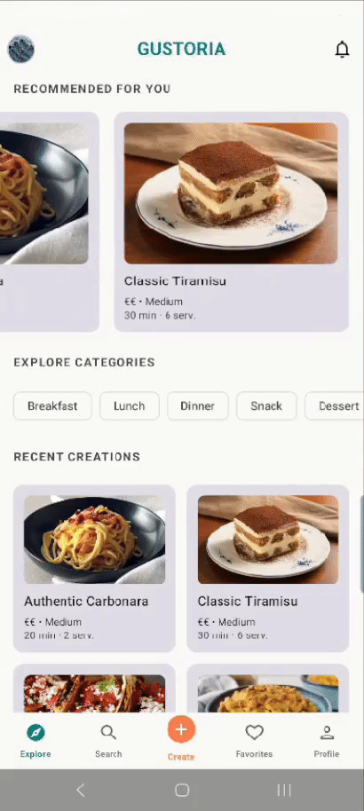
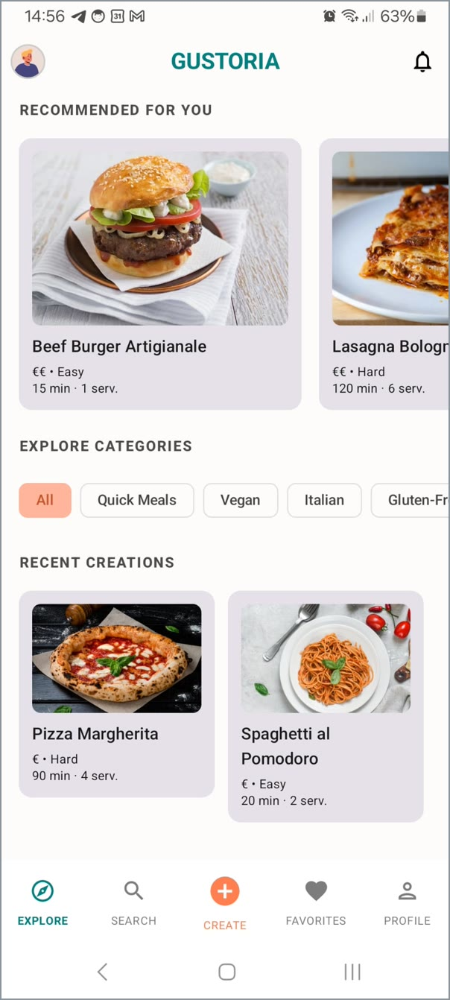
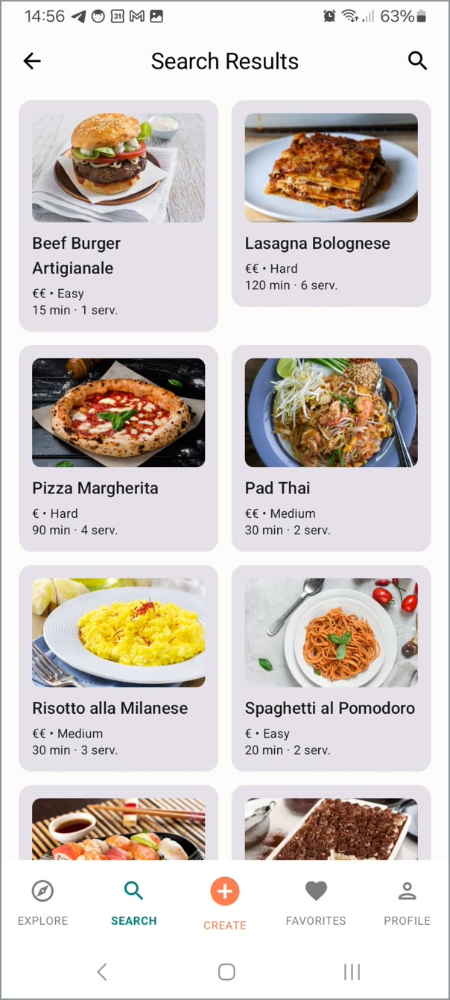
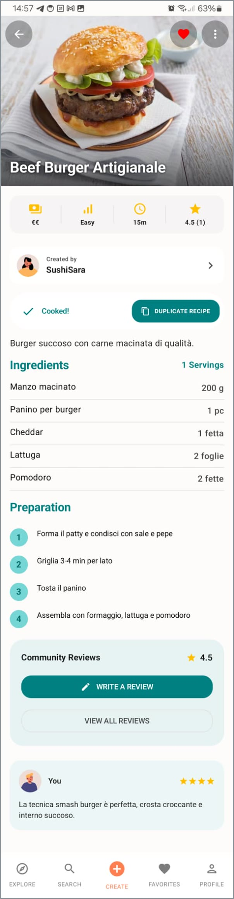
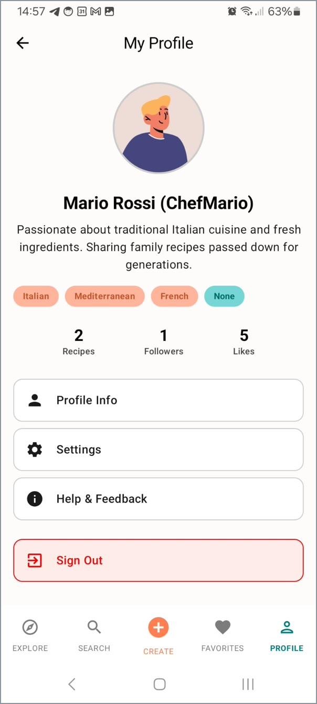
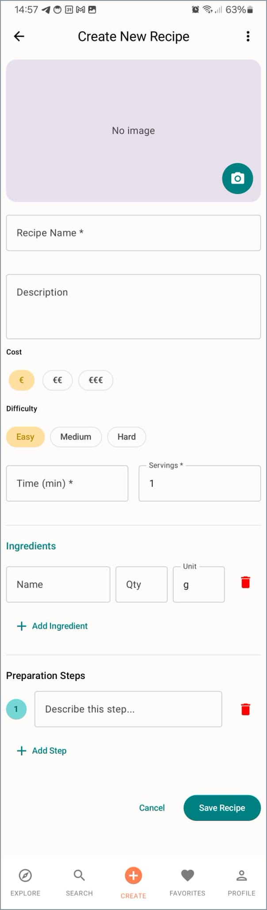
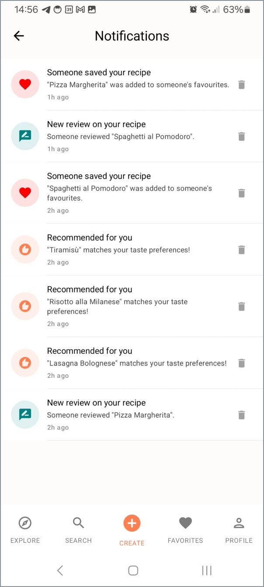

# Gustoria

A recipe-sharing Android app: discover recipes, cook them, review them, and share your own.

Built in Kotlin with Jetpack Compose and Firebase as a team project for the **Mobile Application
Development** course at Politecnico di Torino (2026).

**Kotlin** · **Jetpack Compose** · **Material 3** · **Firebase** · **Supabase Storage** · minSdk 29 · targetSdk 36

<p align="center">
  
</p>

---

## Screenshots

| Home | Search | Recipe |
|---|---|---|
|  |  |  |

| Profile | Create a recipe | Notifications |
|---|---|---|
|  |  |  |

---

## Features

- **Sign in with Google** through the AndroidX Credential Manager, backed by Firebase Auth, plus a
  demo account used during development to test the app without signing in.
- **Home feed** with recipes recommended from the user's stated taste preferences.
- **Search** across recipes with filters (cuisine, cost, dietary preferences) on a dedicated filter
  screen, and a history of recent searches.
- **Recipe creation and editing**, with photos taken in-app via CameraX or picked from the gallery.
- **Recipe details** with ingredients, steps, and a "mark as cooked" action.
- **Favourites and collections**, likes, and the ability to duplicate someone else's recipe into
  your own collection.
- **Reviews** with a rating and optional photos, listed per recipe.
- **Notifications** when a recipe of yours is saved or reviewed, and for new recommendations.
- **Public profiles** with bio, culinary preferences, cooking role, and recipe/follower/like counts.
- **Settings**: dark mode and adjustable font size, persisted across sessions.

## Tech stack

| Area | Choice |
|---|---|
| Language | Kotlin |
| UI | Jetpack Compose, Material 3, Navigation Compose |
| State | ViewModel + `StateFlow`, unidirectional data flow |
| Auth | Firebase Auth with Google via AndroidX Credential Manager |
| Database | Cloud Firestore |
| Image storage | Supabase Storage |
| Camera & images | CameraX, Coil |
| Serialization | kotlinx.serialization |
| Build | Gradle 9.3.1, AGP 9.1.1, JDK 21 toolchain |

## Architecture

The app follows an MVVM layering with repository interfaces, so the UI never talks to Firebase
directly:

```
app/src/main/java/com/example/gustoria/
├── dataclass/    Domain models (Recipe, Review, User, Notification, ...)
├── domain/       Repository interfaces (RecipeRepoInterface, UserRepoInterface, ...)
├── data/         Implementations
│   ├── firebaseRepo/   Firestore repositories
│   ├── auth/           SessionManagerFacade over FirebaseAuth
│   ├── utils/          Supabase client and image upload
│   └── AppContainer.kt Manual dependency container
├── viewmodel/    One ViewModel per feature, exposing UI state as StateFlow
└── ui/           Compose screens, grouped by feature, plus navigation graph and theme
```

`domain/` defines *what* the app needs; `data/` decides *how* it is fetched. Swapping the backend
means writing new implementations of the same interfaces — during development the app ran against
in-memory repositories before Firebase was wired in.

## Getting started

### Prerequisites

- A recent Android Studio release with support for Android Gradle Plugin 9.1, and a JDK 21
  toolchain (the one bundled with Android Studio works)
- Android SDK 36
- A Firebase project and a Supabase project of your own — the ones used during the course are not
  included in this repository

### 1. Firebase

1. Create a project in the [Firebase console](https://console.firebase.google.com/).
2. Add an Android app with the package name `com.example.gustoria`.
3. Enable **Authentication → Google** and **Cloud Firestore**.
4. Download `google-services.json` and place it in `app/`.

`app/google-services.json` is deliberately git-ignored: it identifies a specific Firebase project,
so each developer supplies their own.

### 2. Supabase (image storage)

1. Create a project at [supabase.com](https://supabase.com/) and add a public storage bucket for
   recipe images.
2. Copy the project URL and the `anon` key from the project's API settings.

### 3. Local configuration

Add the values to `local.properties` in the repository root (git-ignored):

```properties
sdk.dir=/path/to/your/Android/sdk
SUPABASE_URL=https://your-project.supabase.co
SUPABASE_ANON_KEY=your-anon-key
```

They are exposed to the app as `BuildConfig.SUPABASE_URL` and `BuildConfig.SUPABASE_ANON_KEY`.
Without them the app still builds, but image upload will fail at runtime.

### 4. Build and run

```bash
./gradlew assembleDebug
```

Or open the project in Android Studio and run the `app` configuration on a device or emulator with
API 29 or above.

## Project history

The course ran as five incremental lab repositories followed by a final submission, each one
importing the previous. This repository joins them into a single continuous history, from the first
commit in March 2026 to the final submission in June 2026, with every author's commits preserved.

Build artifacts, IDE configuration, course submission media, and backend configuration files were
removed from the whole history, not just from the latest commit.

## Team

Four students, all contributing across the stack:

| | |
|---|---|
| Francesca De Bortoli | [@Franci8856](https://github.com/Franci8856) |
| Filippo Ferrari | [@Filippo-F](https://github.com/Filippo-F) |
| Adamo Nardelli | [@AdamoNard](https://github.com/AdamoNard) |
| Andrea Ugliano | [@TigerSoulbound](https://github.com/TigerSoulbound) |
